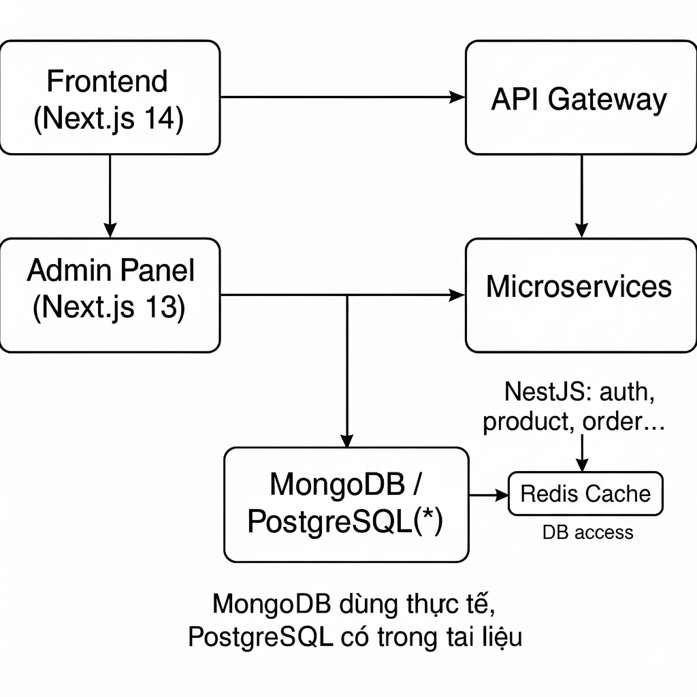
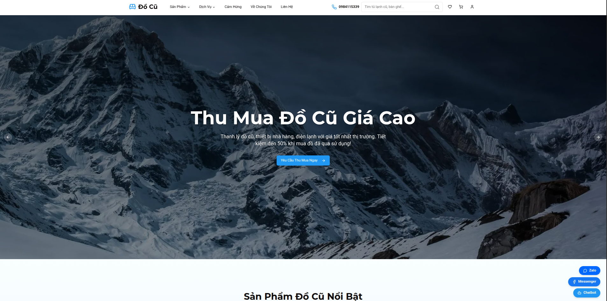
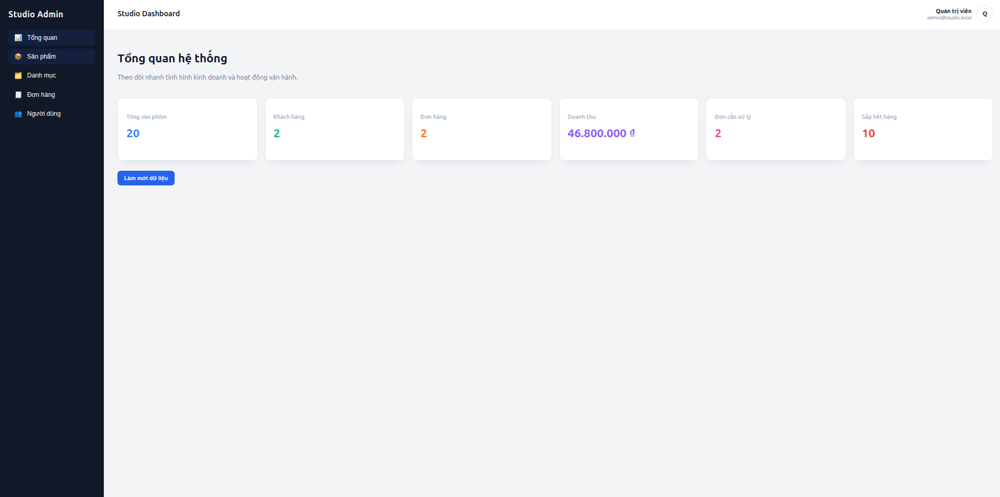

# Second-hand Web VietNam

Nền tảng thương mại điện tử dành cho đồ đã qua sử dụng tại Việt Nam. Hệ thống được xây dựng theo mô hình monorepo, kết hợp Next.js và NestJS microservices để phục vụ trải nghiệm mua bán, quản trị và gợi ý sản phẩm theo thời gian thực.

---

## Mục Lục
- [Tổng Quan](#tổng-quan)
- [Điểm Nổi Bật](#điểm-nổi-bật)
- [Kiến Trúc Hệ Thống](#kiến-trúc-hệ-thống)
- [Giao Diện Tham Khảo](#giao-diện-tham-khảo)
- [Công Nghệ Chủ Đạo](#công-nghệ-chủ-đạo)
- [Cấu Trúc Monorepo](#cấu-trúc-monorepo)
- [Thiết Lập Môi Trường](#thiết-lập-môi-trường)
- [Vận Hành & Phát Triển](#vận-hành--phát-triển)
- [Kiểm Thử](#kiểm-thử)

---

## Tổng Quan
- **Mục tiêu**: Xây dựng sàn thương mại điện tử cho phép người dùng đăng bán, tìm kiếm và giao dịch đồ second-hand an toàn, hiệu quả.
- **Quy mô**: Monorepo gồm 2 ứng dụng Next.js (frontend & admin) và cụm microservice NestJS giao tiếp qua API Gateway.
- **Trải nghiệm**: Hỗ trợ tư vấn sản phẩm dựa trên AI, quản trị tập trung và luồng dữ liệu realtime.

---

## Điểm Nổi Bật
- **Frontend hiện đại**: Next.js 14 App Router (TypeScript, React 18, TailwindCSS, Radix UI) cho phép SEO tốt và hiệu năng cao.
- **Dashboard quản trị**: Ứng dụng Next.js 13 riêng, tối ưu thao tác nghiệp vụ, theo dõi đơn hàng và khách hàng.
- **API Gateway GraphQL**: NestJS đảm nhiệm BFF, xác thực JWT, điều phối request tới microservices.
- **Microservices domain-driven**: Product, Category, Order, User, Cart, Auth, AI, Contact… tách biệt, dễ mở rộng và triển khai.
- **AI Recommendation**: Tích hợp Genkit SDK (Gemini) để đề xuất sản phẩm phù hợp hành vi người dùng.
- **Hạ tầng linh hoạt**: Docker Compose cho môi trường dev, sẵn sàng tách container theo service khi triển khai.

---

## Kiến Trúc Hệ Thống


1. Người dùng truy cập `frontend` (cổng 9002) hoặc quản trị viên truy cập `admin` (cổng 3005).
2. Request GraphQL/REST được gửi tới API Gateway (NestJS) và được xác thực qua JWT.
3. Gateway điều hướng request tới microservice tương ứng thông qua TCP/gRPC hoặc REST nội bộ.
4. Microservice xử lý nghiệp vụ, tương tác với MongoDB/PostgreSQL và trả dữ liệu về Gateway.
5. Gateway tổng hợp, phản hồi client; các tác vụ AI, đồng bộ dữ liệu được thực thi nền qua `ai-service`.

---

## Giao Diện Tham Khảo




---

## Công Nghệ Chủ Đạo
| Nhóm | Công nghệ |
| --- | --- |
| **Ngôn ngữ** | TypeScript (frontend/backend), Python (kiểm thử e2e) |
| **Frontend** | Next.js 14 App Router, React 18, Apollo Client, TailwindCSS, Radix UI, React Hook Form, Zod, Zustand |
| **Admin** | Next.js 13, React 18, Axios, biểu đồ realtime |
| **API Gateway** | NestJS GraphQL, `@nestjs/microservices`, RxJS, JWT Strategy |
| **Microservices** | NestJS, Mongoose (MongoDB), TypeORM (PostgreSQL), giao tiếp TCP/gRPC |
| **AI Layer** | Genkit SDK, `@genkit-ai/googleai`, mô hình `googleai/gemini-2.5-flash` |
| **Hạ tầng** | Docker, Docker Compose, Yarn Workspaces |
| **Testing** | Pytest + Selenium, Jest (NestJS), Testing Library (Next.js) |

---

## Cấu Trúc Monorepo
```
.
├── frontend/                # Next.js 14 App Router (UX khách hàng)
├── admin/                   # Next.js 13 dashboard quản trị
├── backend/
│   ├── api-gateway/         # NestJS BFF GraphQL Gateway
│   └── services/
│       ├── product-service/ # Quản lý sản phẩm (NestJS + Mongoose)
│       ├── category-service/
│       ├── order-service/
│       ├── user-service/
│       ├── cart-service/
│       ├── auth-service/    # JWT/AuthN/AuthZ (TypeORM/PostgreSQL)
│       ├── ai-service/      # Nền tảng AI/ML
│       └── contact-service/
├── docs/                    # Tài liệu kiến trúc & luồng dữ liệu
├── tests/                   # Bộ kiểm thử tự động (pytest + Selenium)
├── docker-compose.yml       # Khởi tạo toàn bộ cụm dịch vụ
├── init-mongo.js            # Seed MongoDB cục bộ
└── README.md
```

---

## Thiết Lập Môi Trường
1. Cài đặt Node.js ≥ 18, Yarn (hoặc npm) và Python (cho e2e tests).
2. Cài đặt phụ thuộc tại thư mục gốc bằng `yarn install`.
3. Nhân bản file môi trường:
   ```bash
   cp admin/.env.example admin/.env
   # Thực hiện tương tự cho frontend và từng service (theo hướng dẫn nội bộ)
   ```
4. Chuẩn bị cơ sở dữ liệu:
   - MongoDB cho các service domain (product, order, user, cart...).
   - PostgreSQL (tuỳ chọn) cho auth-service nếu sử dụng TypeORM.
5. Cấu hình các dịch vụ phụ trợ cần thiết (RabbitMQ, email, storage) trước khi đưa vào sản xuất.

---

## Vận Hành & Phát Triển
### Chạy dạng Workspaces
```bash
# Cài phụ thuộc
yarn install

# Gateway
yarn workspace api-gateway start:dev

# Các microservice chính (mở tab riêng)
yarn workspace product-service start:dev
yarn workspace category-service start:dev
yarn workspace order-service start:dev
yarn workspace user-service start:dev
yarn workspace cart-service start:dev
# (auth-service, ai-service, contact-service khởi động tương tự khi cần)

# Frontend & Admin
yarn workspace frontend dev
yarn workspace luxhome-admin dev
```
> Một số service (auth, ai) yêu cầu thông tin kết nối DB/credential riêng.

### Chạy bằng Docker Compose
```bash
docker compose up --build
```
- MongoDB: `27017`
- API Gateway: `4000`
- Frontend: `9002`
- Admin: `3005`
- Microservices: `3001 – 3007`

### Triển khai Production
- Đóng gói mỗi service thành container riêng, quản lý biến môi trường cho secret/connection string.
- Thiết lập CI/CD: lint → typecheck → test → deploy theo môi trường (staging/production).
- Giám sát & quan sát: tích hợp log collector (ELK/Cloud Logging) và OpenTelemetry (khi cần tracing).

---

## Kiểm Thử
- **Lint/Format**: `yarn workspace <package> lint` (ESLint + Prettier).
- **Typecheck**: `yarn workspace frontend typecheck`, Nest CLI build cho backend.
- **E2E**: `pytest -m selenium` (yêu cầu Selenium Grid hoặc ChromeDriver). Page Object đặt tại `tests/e2e/pages`.
- **Genkit Sandbox**: `yarn workspace frontend genkit:dev` để thử nghiệm luồng gợi ý AI.

---

## Góp Ý & Phát Triển
- Đề xuất mở rộng microservice AI để xử lý phân tích hành vi nâng cao, tích hợp Kafka/RabbitMQ cho event-driven.
- Khuyến nghị bổ sung hệ thống thông báo realtime (WebSocket) cho người dùng và quản trị viên.
- Mọi ý kiến đóng góp hoặc câu hỏi xin vui lòng tạo issue/PR trong repository.
